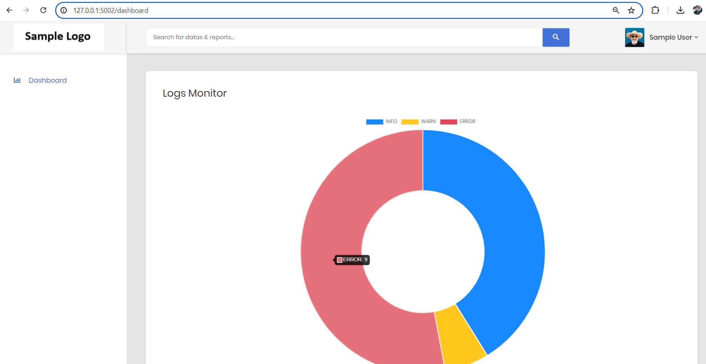

# Sample Kafka and Zookeeper Project

This repository demonstrates a sample setup of Kafka and Zookeeper on Windows OS. The project is built using the Flask framework in Python with a frontend using Jinja templates. Additionally, SocketIO is used to receive messages in real-time.

## Technology Stack
- Python (Flask Framework)
- Apache Kafka
- Apache Zookeeper
- SocketIO
- Jinja Templates
- Postman (for API testing)

## Prerequisites
- Kafka and Zookeeper installed on Windows OS
- Python and pip installed
- Postman for API testing

## Project Setup and Execution

### 1. Start ZooKeeper
```bash
zookeeper-server-start.bat ../../config/zookeeper.properties
```

### 2. Start the Kafka Server
```bash
kafka-server-start.bat ../../config/server.properties
```

### 3. Check for Existing Topics
```bash
kafka-topics.bat --list --bootstrap-server localhost:9092
```

### 4. Create a New Topic (if not created)
```bash
kafka-topics.bat --create --bootstrap-server localhost:9092 --replication-factor 1 --partitions 1 --topic logs
```
Here, `logs` is the topic name.

### 5. Start the Backend and Frontend
Activate your virtual environment, then run:
```bash
python app.py
```

### 6. Test Using Postman
- Hit the API: `http://127.0.0.1:5001/send_log`
- Example Response:
```json
{
  "log": {
    "level": "WARN",
    "message": "File uploaded",
    "timestamp": "08:13:25"
  },
  "status": "Log sent"
}
```

## Frontend Pages
1. **Login Page** - [http://127.0.0.1:5002/](http://127.0.0.1:5002/) *(Static Page)*
2. **Dashboard Page** - [http://127.0.0.1:5002/dashboard](http://127.0.0.1:5002/dashboard) *(Real-time Logs Display)*

## Screenshots


## Contributing
Feel free to submit pull requests for improvements or bug fixes.